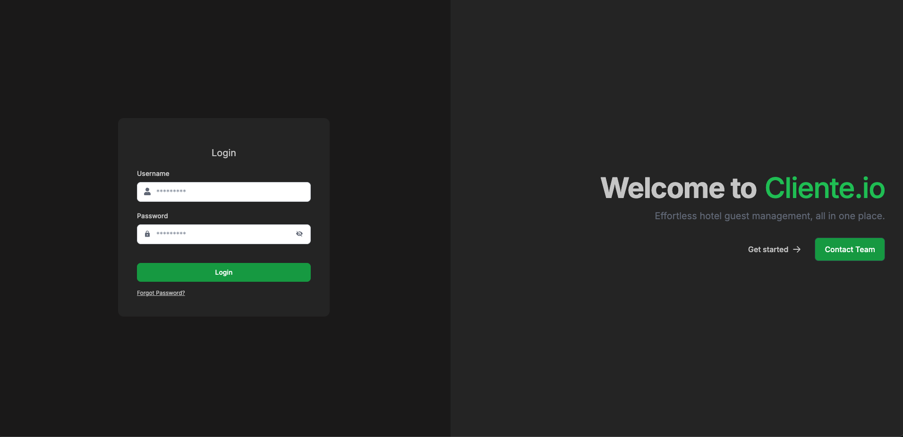
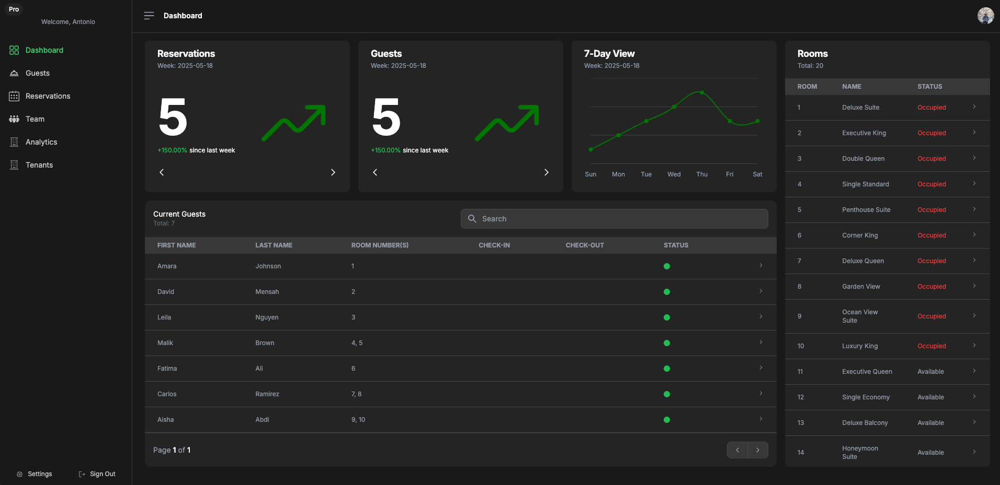
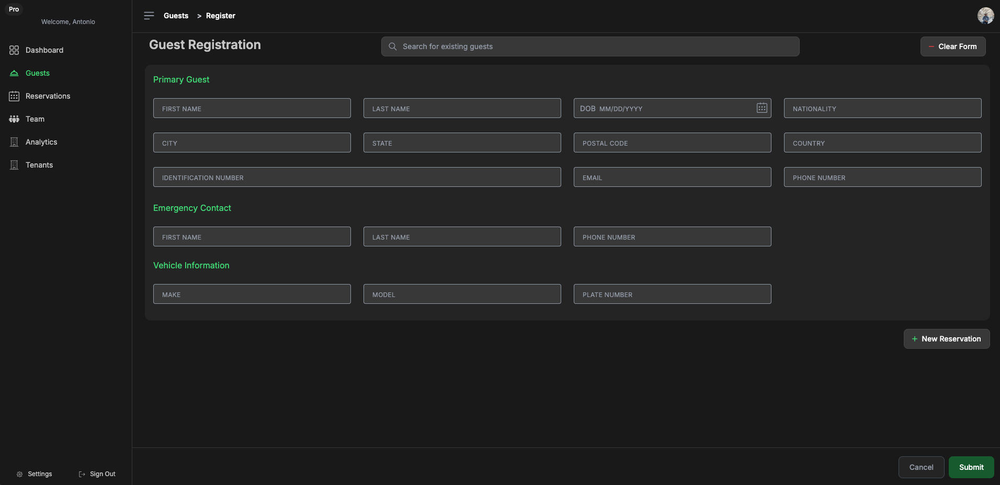
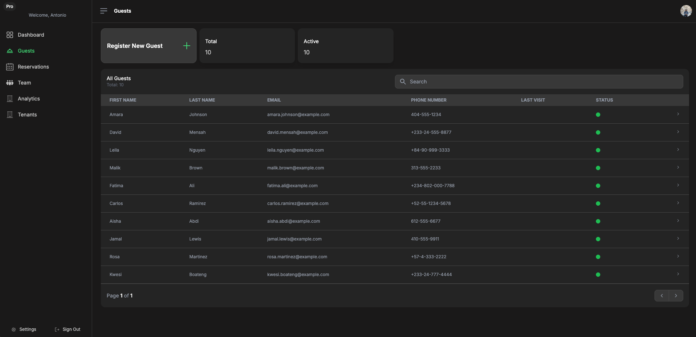
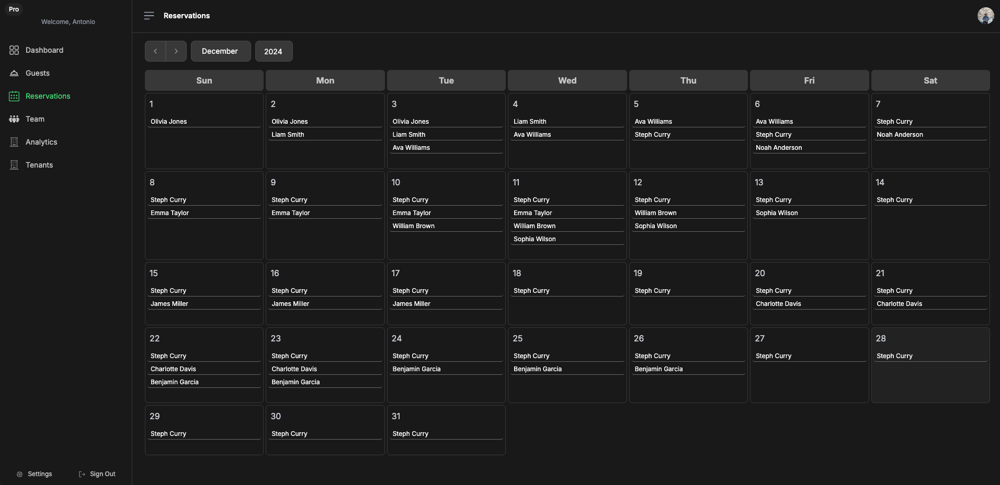

# Cliente.io

**⚠️ Note: This project has been completed and sold (March 2, 2025). This repository showcases the original frontend application I developed.**

A robust SaaS platform tailored for boutique hotels in South America, offering intuitive guest, reservation, and room management. Built with a responsive, modern frontend and an optimized cloud-based backend to streamline hotel operations.

## Screenshots

|                             Login                             |                 Dashboard & Analytics                 |
| :-----------------------------------------------------------: | :---------------------------------------------------: |
|                            |            |
|                    **Guest Registration**                     |                 **Guest Management**                  |
|  |  |
|                   **Reservation Calendar**                    |
|           |

## Features

### Dashboard & Analytics

- **Real-time Analytics**: Interactive charts and KPIs for hotel performance
- **Reservation Calendar**: Visual calendar with booking management
- **Occupancy Tracking**: Live room status and availability overview
- **Revenue Insights**: Financial reporting and trend analysis

### Guest Management Interface

- **Guest Directory**: Searchable guest database with detailed profiles
- **Check-in/Check-out**: Streamlined guest arrival and departure process
- **Guest History**: Complete stay history and preferences tracking
- **Quick Search**: Instant guest lookup with advanced filtering

### Reservation System

- **Booking Management**: Create, modify, and cancel reservations
- **Calendar View**: Month/week/day views for reservation planning
- **Availability Matrix**: Real-time room availability tracking
- **Booking Analytics**: Reservation trends and performance metrics

### Room Management

- **Room Status Board**: Visual room status dashboard
- **Housekeeping Integration**: Room cleaning and maintenance tracking
- **Room Details**: Comprehensive room information and amenities
- **Occupancy Management**: Current and upcoming room assignments

### Multi-language Support

- **Spanish/English**: Full internationalization for South American market
- **Dynamic Language Switching**: Real-time language toggle
- **Localized Content**: Region-specific formatting and content

### User Experience

- **Responsive Design**: Optimized for desktop, tablet, and mobile devices
- **Dark/Light Mode**: User preference theme switching
- **Progressive Web App**: App-like experience with offline capabilities
- **Fast Performance**: Optimized loading and smooth interactions

## Tech Stack

**Frontend Framework:**

- React
- Vite

**UI/UX Libraries:**

- Tailwind CSS
- Material-UI
- Framer Motion
- React Icons

**Data Visualization:**

- Recharts

**Form Management:**

- React Hook Form
- Zod

**State & API Management:**

- Axios
- JWT Decode
- React Router DOM

**Internationalization:**

- i18next
- react-i18next
- Moment.js
- Day.js

**Utilities:**

- Clsx
- UUID
- Browser Image Compression

**Development Tools:**

- ESLint
- TypeScript support

## Design System

**Modern UI Components:**

- Consistent design language across all interfaces
- Accessible components following WCAG guidelines
- Responsive breakpoints for all device sizes
- Custom animations and micro-interactions

**Color Palette:**

- Professional hotel industry color scheme
- High contrast ratios for accessibility
- Dark mode support with automatic switching

**Typography:**

- Clean, readable font hierarchy
- Multi-language font support
- Optimized for long-form content reading

## Installation & Setup

### Prerequisites

- Node.js (v16+)
- npm or yarn package manager

### Local Development

```bash
# Clone the repository
git clone https://github.com/yourusername/cliente-frontend.git
cd cliente-frontend

# Install dependencies
npm install

# Set up environment variables
cp .env.example .env
# Add your API endpoints and configuration

# Start development server
npm start

# Build for production
npm run build

# Preview production build
npm run preview
```

## Environment Variables

```env
VITE_API_BASE_URL=https://api.cliente.com
VITE_AWS_CLOUDFRONT_URL=https://your-cloudfront-domain.com
VITE_APP_VERSION=1.0.0
VITE_ENVIRONMENT=production
```

## Responsive Design

**Mobile-First Approach:**

- Optimized touch interfaces for mobile devices
- Collapsible navigation for smaller screens
- Touch-friendly buttons and form elements

**Tablet Optimization:**

- Enhanced dashboard layouts for tablet viewing
- Gesture support for calendar navigation
- Split-screen views for efficient workflow

**Desktop Experience:**

- Full-featured dashboard with multiple panels
- Keyboard shortcuts for power users
- Multi-window support for complex operations

## Deployment Architecture

**Frontend Hosting:**

- AWS CloudFront CDN for global content delivery
- AWS S3 for static asset storage
- GitHub Actions for automated CI/CD pipeline

**Performance Optimization:**

- Code splitting for faster initial load times
- Image compression and lazy loading
- Progressive loading for large datasets

**Security Features:**

- JWT token management with automatic refresh
- XSS protection and content security policies
- Secure API communication with HTTPS

## Backend Integration

This frontend connects to the [Cliente API](https://github.com/AntonioRice/cliente-crm-api) for:

- User authentication and authorization
- Guest and reservation data management
- Real-time updates and notifications
- File uploads and media management

## Architecture Highlights

- **Component-Based Architecture**: Reusable, maintainable React components
- **Custom Hooks**: Efficient state management and API integration
- **Performance Optimization**: Lazy loading, memoization, and code splitting
- **Accessibility**: WCAG compliant components and keyboard navigation
- **Internationalization**: Full multi-language support with RTL consideration
- **Progressive Web App**: Offline capabilities and app-like experience

## Creator & Developer

**Antonio Rice**  
Full-Stack Software Engineer  
[Portfolio](https://www.antoniorice.com)  
_Original developer of the Cliente hotel management platform_

---

_This repository demonstrates expertise in modern React development, enterprise SaaS frontend architecture, and hospitality industry UX design. The application successfully served small hotels across South America with a focus on usability and performance._
